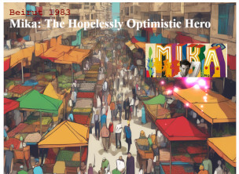

# interactive-game

## This is a work in progress project to create a  humorous  animated action/adventure game about the singer Mika, including his refugee experience and places he's lived. 

It is to target age 18 - 25 year olds. The player will comlplete challenges such as those that refugees face to highlight Mikas plight, travels and career.

## Game title: Mika: The Hopelessly Optimistic Hero 

Screenshot of opening game:

## Story:
Mika, a flamboyant singer with a voice like sunshine and a heart full of wanderlust, isn't your average pop star. He's a citizen of the world, shaped by his childhood as a refugee and his globetrotting upbringing. But his world gets flipped upside down when the nefarious Baron Gloom (think: a monocle-wearing villain with a penchant for silence) steals all the world's music!
##
Gameplay:

 The game is a side-scrolling action-adventure with a heavy dose of humor. Players control Mika as he travels through vibrant, cartoon versions of the places he's lived – Beirut, Paris, London – each with unique challenges that reflect Mika's experiences and the refugee journey.
##
Challenges with a Wink:
##
Beirut Blitz:

 Race through a bustling market, dodging vendors and haggling for ingredients to make Mika's signature dish (a hilarious cooking mini-game). This level highlights the hustle and energy of his childhood home.

 ##
Parisian Peril:

 Help Mika navigate a hilariously bureaucratic immigration office, deciphering nonsensical forms and dodging grumpy officials (think Monty Python meets paperwork). This level satirizes the complexities refugees face when seeking new homes.
##
London Lockdown: 

Join Mika on a high-octane parkour chase through London's iconic landmarks, dodging grumpy pigeons and outsmarting robotic security guards guarding a secret music vault. This level references Mika's rise to fame and the challenges of adapting to a new culture.
##
Mika's Special Abilities:

The Mika-phone: Mika's iconic voice becomes a weapon. He can shatter obstacles with high notes, confuse enemies with scatting, and even unlock doors with perfectly harmonized melodies (think: a musical version of Sam Fisher's Splinter Cell).
The Chameleon Cloak: Mika's flamboyant outfits become a disguise tool. Dress up in a French beret for a beret-obsessed guard, or don a London bobby hat to trick enemies into thinking he's one of them.
##
Humor is Key:

Throughout the game, Mika throws out witty one-liners, pop culture references (think: "This is harder than winning Eurovision!"), and self-deprecating jokes. Funny cutscenes interspersed with the action showcase his interactions with quirky sidekicks and his ongoing struggle with stage fright (despite being a pop star!).
##
Beyond the Levels:

Between levels, players can unlock bonus content like:

Mika's Refugee Memoir: Funny, heartwarming stories about his childhood experiences.
Mika's Mixtape Mayhem: Mini-games based on Mika's musical career, like composing a hit single or performing a high-energy concert.

By the end of the game, players will have not only helped Mika restore music to the world, but also gained a deeper understanding of his journey and the challenges faced by refugees. It's a humorous adventure with a heart, highlighting Mika's optimism and the power of music to bring people together.

#Link to deployed game:

https://vickysug.github.io/interactive-game/

